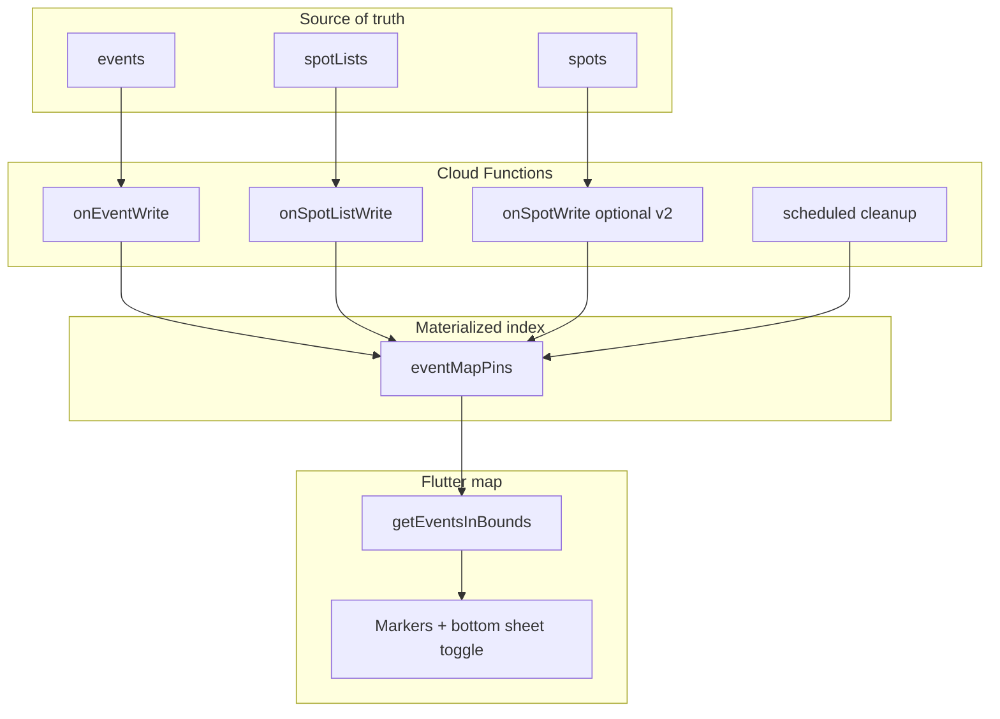

# Events on the map

Plan for showing parkour events on the explore map: materialized geo pins, query API, map UI, and spot-card badges.

## Goals

- Show events in the current map viewport (bottom panel + markers).
- Support events with their own coordinates, direct spot links, and spot-list links.
- Keep map queries fast (same bounding-box pattern as spots).
- Keep canonical event data in `events`; use a derived collection for geo queries.

## Current state

| Area | Today |
|------|--------|
| `ParkourEvent` | Optional `latitude` / `longitude`, `spotIds` (max 50 in rules). No `spotListIds`. |
| Map spots | `getTopSpotsInBounds` queries `spots` by lat/lng ranges. |
| Per-spot events | `getNextUpcomingEventForSpot` uses `events` + `array-contains` on `spotIds` — fine for one spot, not for map scale. |
| Spot lists | No link to events. |

## Product decisions

1. **Spot lists** — Only **public** and **unlisted** lists are expanded when materializing pins. Private lists are ignored.
2. **Time window** — **No past events** on the map. Materialize and query only upcoming (and in-progress) events.
3. **Duplicates** — Skip events with `duplicateOf` set (same as `getNextUpcomingEventForSpot`).
4. **Spots without location** — **No pins** for spots missing valid `latitude` / `longitude` (hidden/duplicate spots are also excluded).

Additional implicit rules from earlier discussion:

- Events with no coordinates and no resolvable spot pins do not appear on the map (e.g. ICS imports until linked).
- Direct `spotIds` remain capped at 50 (Firestore rules). List expansion may produce more pins; cap materialized spot pins per event if needed (e.g. 100) and log truncation.

---

## Architecture overview



**One-way linking:** Events store `spotListIds: string[]`. Spot lists do **not** store `eventIds`. When a list changes, query `events` where `spotListIds` `array-contains` `listId` and re-materialize those events.

---

## Data model

### `events` (extend)

Add:

```text
spotListIds: string[]   // references to spotLists/{id}
```

Keep existing `spotIds`, optional `latitude` / `longitude`, `startAt`, `endAt`, `duplicateOf`, etc.

### `eventMapPins` (new collection)

One document per **map pin**. A single event may produce multiple pins.

| Field | Type | Notes |
|-------|------|--------|
| `eventId` | string | Parent event |
| `kind` | `"venue"` \| `"spot"` | Venue = event coordinates; spot = linked spot location |
| `latitude` | number | Required for query |
| `longitude` | number | Required for query |
| `spotId` | string? | Set when `kind == "spot"` |
| `startAt` | timestamp | For sort / upcoming filter |
| `endAt` | timestamp? | For in-progress vs ended |
| `title` | string | Short preview (denormalized) |
| `duplicateOf` | string? | Omit from queries when set (prefer not writing pins at all) |

**Document IDs** (idempotent upserts):

- Venue: `{eventId}_venue`
- Spot: `{eventId}_spot_{spotId}`

### Pin kinds

| Kind | When | Coordinates |
|------|------|-------------|
| `venue` | Event has valid lat/lng + address (per existing rules) | Event lat/lng |
| `spot` | Spot in `event.spotIds` or in expanded public/unlisted list | Spot lat/lng |

Do **not** create a `spot` pin if the spot has no valid coordinates.

---

## Materialization

### When to run

| Trigger | Action |
|---------|--------|
| `events/{eventId}` create / update / delete | Rebuild all pins for that event |
| `spotLists/{listId}` update | Find events with `spotListIds` containing `listId`; rebuild each |
| `spots/{spotId}` update (optional v2) | Rebuild events that reference this spot directly (and optionally via lists) |
| Scheduled job | Delete pins for events that are no longer upcoming |

### Algorithm (per event)

1. Delete existing pins for `eventId` (by known doc IDs or `where eventId == …`).
2. If `duplicateOf` is set → **stop** (no pins).
3. If event is **past** (`endAt < now`, or `endAt` null and `startAt < now`) → **stop** (no pins).
4. **Venue pin:** if `latitude` and `longitude` present → write `{eventId}_venue`.
5. **Spot pins:** build spot id set:
   - `event.spotIds`
   - For each `event.spotListIds`: load list; if visibility is **public** or **unlisted**, add `effectiveSpotIds`; skip **private** lists.
6. For each spot id: load spot; skip if hidden, duplicate, or missing/invalid lat/lng; write `{eventId}_spot_{spotId}`.
7. Apply per-event cap on spot pins if list expansion is large (e.g. max 100); log when truncated.

### List visibility

```text
public   → expand
unlisted → expand
private  → skip (no pins from this list)
```

---

## Querying the viewport

New callable (mirror `getTopSpotsInBounds`): **`getEventsInBounds`**

**Input:** `minLat`, `maxLat`, `minLng`, `maxLng`, `limit` (e.g. 100)

**Query:** `eventMapPins` with latitude/longitude range (same bounding-box approach as spots), plus:

- `startAt >= now` (or in-progress: `endAt >= now` OR (`endAt` null AND `startAt >= now`))
- Exclude any doc that somehow still has `duplicateOf` set

**Response:**

| Field | Meaning |
|-------|---------|
| `pins` | Pin documents for markers |
| `shownCount` | Pins returned (after limit) |
| `totalCount` | Pins in bounds before limit (optional; may be expensive) |
| `eventCount` | **Distinct** `eventId` in viewport — use for “23 events” in UI |

**Firestore indexes:** composite on `latitude` + `longitude`; add `startAt` if filtering upcoming server-side.

---

## Map UI

### Markers

| Marker | Source |
|--------|--------|
| Normal spot | Existing spot load |
| Event venue | `eventMapPins` with `kind: venue` — distinct icon (e.g. calendar) |
| Spot with event | `kind: spot` — spot pin variant or badge |

**Overlap:**

- Event with both venue and linked spots → show venue pin + spot pins.
- Multiple events on one spot → v1: multiple pins or show next-upcoming only; v2: aggregate on spot.

### Bottom sheet toggle

Segmented control (same pattern as amenities/source filters on explore):

- **Spots** — existing copy, e.g. “123 spots (100 best shown)”.
- **Events** — deduped events from pins in view, e.g. “23 events” (short labels / emoji optional).

Load pins on camera idle alongside `_loadSpotsForCurrentView`.

### Spot cards

Do not call `getNextUpcomingEventForSpot` per card in the map list.

- **v1:** Build `Map<spotId, EventSummary>` from pins loaded for the viewport; pass into `SpotCard` for badge.
- **v2 (optional):** Denormalize `nextEventAt` / `nextEventId` on `spots` when materializing spot pins.

Badge: upcoming event at this spot (direct link or via list).

---

## Linking model summary

| Link | Direction | Maintenance |
|------|-----------|-------------|
| Event → spots | `events.spotIds` | Event write → materialize |
| Event → lists | `events.spotListIds` (new) | Event write → materialize |
| List → events | **None** | List write → query events by `spotListIds` |

---

## Rollout phases

1. **Schema** — `events.spotListIds`; `eventMapPins` collection; Firestore indexes and rules.
2. **Functions** — Materialize on event write; re-materialize on list write; scheduled cleanup for past events.
3. **API** — `getEventsInBounds` callable.
4. **Flutter** — Load pins with spots; marker layer; bottom sheet spots/events toggle.
5. **Polish** — Spot card badges from session cache; optional `spots.nextEventAt` denorm.

---

## Out of scope / non-goals

- Geohash (unless bounding-box reads become a bottleneck).
- Storing per-spot coordinates on the event document.
- Bidirectional `spotLists.eventIds` as source of truth.
- Past events on the map.
- Pins for private-list spots or spots without coordinates.
